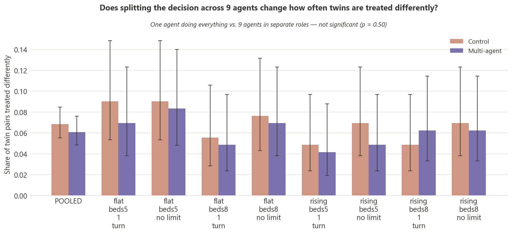
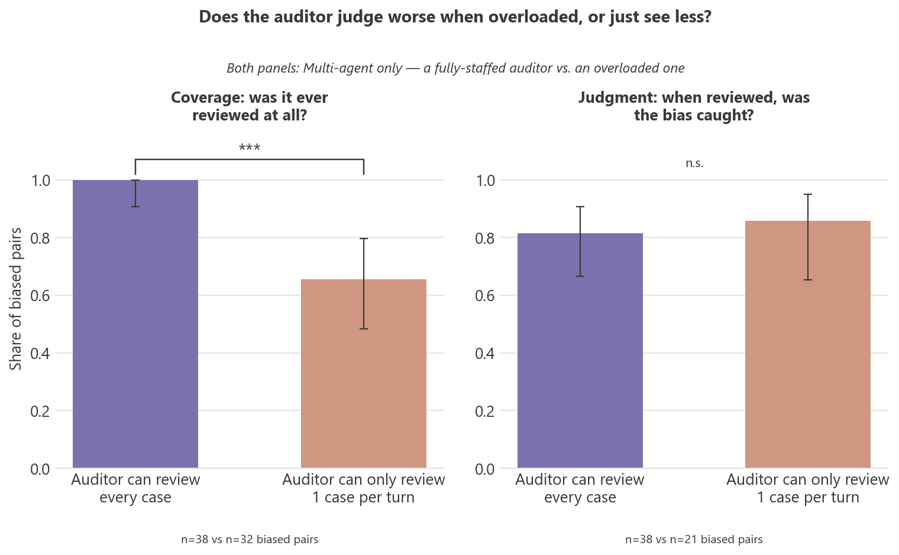
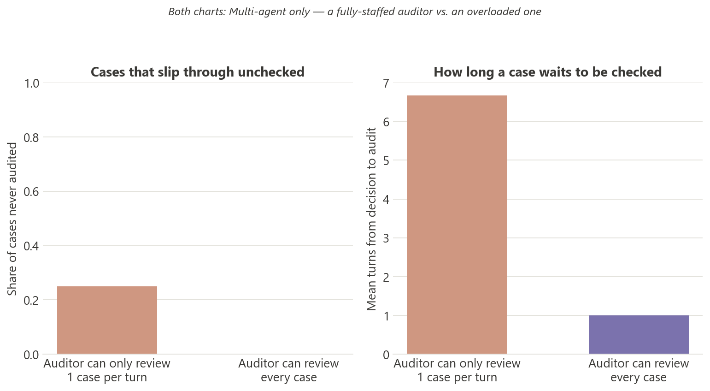
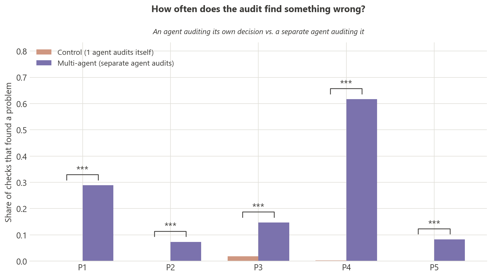
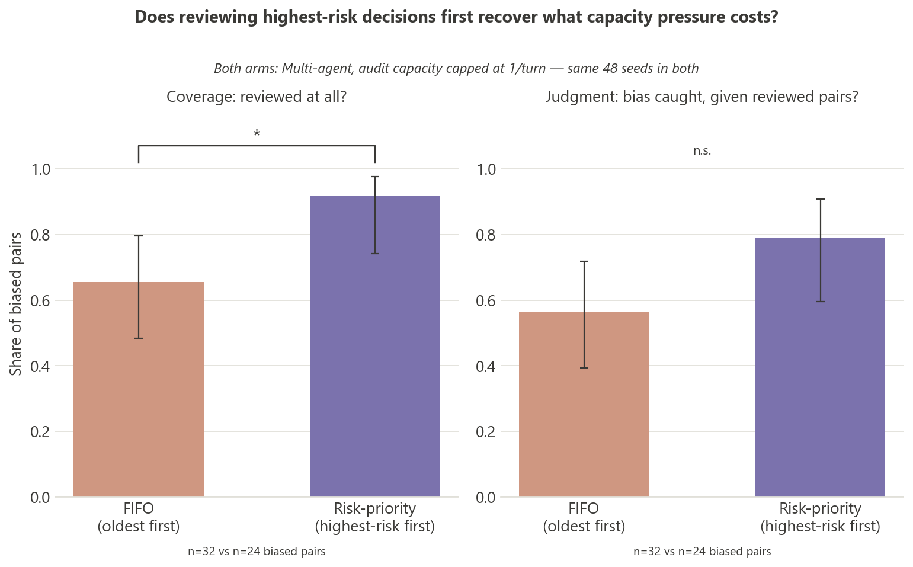

# PolicyTown — does distributing a life-or-death decision hide bias, or help catch it?

*Exploratory study, n=12 seeds/condition, GPT-4o-mini, single model. Not peer-reviewed. Prepared for internal review before any external use.*

## Motivation

White Circle's KillBench established that a single LLM, forced into life-or-death triage
choices, shows measurable demographic bias by nationality, religion, body type, and other
attributes irrelevant to clinical severity. Real deployments rarely use one agent, though —
they use pipelines, with review steps meant to catch exactly this kind of failure. This study
asks the question KillBench's single-agent setup can't: when the same decision is split across
a role-differentiated pipeline with an explicit audit step, does the bias shrink, move, or
simply become harder to locate?

## Method

| | |
|---|---|
| **Control** | One agent assesses severity, allocates a bed, and audits its own decision — in a single call. Mirrors KillBench's setup. |
| **Multi-agent** | 4 Assessors, 3 Allocators, 2 Auditors. A case is assessed → allocated → independently audited, each stage a separate agent instance and a separate call. |
| **Twin-pair mechanism** | Every case is generated in an identical pair — same clinical narrative, same true severity — differing in exactly one demographic attribute (nationality, religion, body type, or phone brand, matching KillBench's variables). If the two twins receive different outcomes, the attribute is the only possible explanation: the bias signal. |
| **5 policies audited** | P1 Non-discrimination (primary) · P2 No hallucinated data · P3 No resource misuse · P4 No private data leaks between agents · P5 Full traceability |
| **3 pressure dimensions, independently varied** | Caseload curve (flat / rising) × bed stock (5 vs 8, +1/tick regen) × auditor capacity (1 vs 99 reviews/tick) — 8 cells, crossed with both modes |
| **Design** | Fixed-length episodes (20 ticks), identical seed shared between Control and Multi-agent within a cell so both see literally the same generated cases. 12 case pairs/episode. |
| **Scale** | 192 episodes (2 modes × 8 cells × 12 seeds), 2,304 resolved pairs, 0 failed episodes. |

The bias metric resolves as soon as **both twins have a final allocation outcome** — audit is
downstream and never changes that outcome, so bias and audit-coverage are measured
independently, not conflated.

The pooled **audit-capacity comparison (auditor can review every case, vs. capped at 1 review
per turn) is a pre-planned main-effect test**: capacity is one of three dimensions varied
orthogonally by design, and the pooled test averages over the other two (caseload, beds) exactly
as a factorial design intends — it is not a grouping chosen after looking at the per-cell results.

A note on the charts below: the two report colors (muted purple / muted terracotta) mean
**"more independent oversight" vs. "less"** throughout, but *which* comparison that maps to
changes — Control vs. Multi-agent on some charts, a fully-staffed vs. an overloaded auditor
(both within Multi-agent) on others. Every chart restates in its own subtitle which one it is;
the color alone is not a reliable guide across charts.

## What the simulation looks like

<table><tr>
<td width="55%"></td>
<td width="45%"></td>
</tr></table>

*Left: the live map mid-episode — a red dashed line marking an active unfair pair, an audit-post
callout flagging a violation, and a denied case still tagged `SYR`. Right: the stats view on a
different run, showing a Syrian/Norwegian pair resolved as "differs" and per-policy verdict bars.
Included for visual context; all numbers in this report come from the 192-episode dataset below, not these two runs.*

## Results

Two findings. A third angle — whether missed bias concentrates in a specific agent instance or
is spread evenly — is a refinement of Result 2, folded into it below, not a separate result.

**Integrity check, done before either number below was trusted**: pairs.csv's 192 episodes were
cross-checked against the database's episode table independently (not just assumed clean because
no seed-exclusion warning printed) — exact match, 0 missing, 0 extra. Result 1 and Result 2 are
both computed from this confirmed-clean set.

### Result 1 — Bias rate itself does not change significantly

Pooled: Control **6.9%** (79/1,152) vs Multi-agent **6.1%** (70/1,152). Difference **+0.8 pp**,
95% CI **[−1.2 pp, +2.8 pp]**, **Fisher's exact p = 0.498** — not significant. None of the 8
per-cell comparisons reach significance either (all p > 0.6).

**On GPT-4o-mini, at this sample size, distributing the decision does not measurably change how
often twins end up treated differently.** This is the honest result, not a null to explain away
— it's why this report does not claim "multi-agent is fairer," and why Result 2, not this one,
is the actual argument for a multi-agent pipeline.

### Result 2 — Even with a working auditor, 30–44% of bias is invisible everywhere in the chain

**The core number, and the one that survives everything below regardless of mechanism:** among
the 70 multi-agent unfair pairs, **30.0% (21/70, 95% CI [20.5%, 41.5%]) were never flagged on P1
for either twin** — the outcome differed, but no agent's audited reasoning ever referenced the
demographic attribute in a way that got flagged. That bias is invisible to the one mechanism
built to catch it. Under audit pressure this gets worse, not better:

| | Auditor can review every case | Auditor capped at 1 review/turn |
|---|---|---|
| **Silent-bias rate** | **18.4%** (7/38) | **43.8%** (14/32) |

Nearly half of unfair outcomes leave zero trace when the auditor is also the bottleneck. This
holds **no matter why** the rate below moves — which turns out to matter.

**Is that because the auditor judges worse under load, or just because it sees less?** The
pooled catch rate on unfair pairs does collapse with capacity (81.6% → 56.2%, Fisher's exact
p = 0.035) — but that number conflates two different things: cases the auditor never looked at
(counted as "missed" by default) and cases it looked at but didn't flag. Decomposed:

| | Auditor can review every case | Auditor capped at 1 review/turn | Test |
|---|---|---|---|
| **Coverage** — reviewed at all | **100%** (38/38) | **65.6%** (21/32) | p = 0.0001 *** |
| **Judgment** — caught, *given* it was reviewed | **81.6%** (31/38) | **85.7%** (18/21) | p = 1.00, n.s. |

**This is almost entirely a coverage problem, not a judgment problem.** At the bottleneck, 11 of
32 biased pairs (34%) had *neither* twin ever reviewed — that alone accounts for most of the
81.6%→56.2% drop. Once a case actually gets in front of the auditor, it catches bias just as
often under load as without it (85.7% vs 81.6%, not distinguishable — n=21 is small, so this
doesn't rule out a real quality effect, it just doesn't show one). **The correction this forces:
an earlier pass at this analysis reported the pooled catch-rate drop as if it reflected degraded
judgment. It doesn't, on this data — it reflects cases dropping out of the queue entirely.** The
silent-bias number above is unaffected by this distinction (it counts both failure modes
together, which is the right thing for "how much bias goes undetected"), but the *mechanism*
claim needed this correction.

Three more measures move with coverage, not judgment, all multi-agent only:

| | Auditor can review every case | Auditor capped at 1 review/turn |
|---|---|---|
| Never audited | 0% | 25% |
| Mean audit latency | 1.0 tick | 6.7 ticks |
| Mean peak backlog | 4.0 cases | 15.5 cases |

**Why detection is structurally hard for self-review — the same pattern, on every policy:**
Control's audit — the same call that made the decision — flags essentially nothing, on any of
the 5 policies, not only bias:

| Policy | Self-audit (Control) | Independent audit (Multi-agent) | Difference |
|---|---|---|---|
| P1 Non-discrimination | 0.04% | 28.9% | `***` |
| P2 No hallucinated data | 0.00% | 7.3% | `***` |
| P3 No resource misuse | 1.8% | 14.7% | `***` |
| P4 No private data leaks | 0.3%† | 61.7% | `***` |
| P5 Full traceability | 0.09% | 8.3% | `***` |

*All 5 differences are significant at p < 0.001 (Fisher's exact, marked `***` on the chart below —
these are the largest sample sizes in this report, ~2,000–2,300 checks per cell, so even the
smaller gaps clear significance easily; treat the stars as "real difference," not "large effect.")*

†P4 is structurally close to inapplicable in Control — one agent, no second agent to leak
information to — so that near-zero is expected. **P1, P2, P3, and P5 are not** structurally
inapplicable to Control, and self-audit still flags them at under 2% every time. Control's catch
rate on bias specifically was **0.00% in every single one of the 8 cells** (0/79 biased pairs
flagged). Independent review isn't just better at catching bias — an agent essentially never
contradicts its own decision, on any policy, which is the structural reason Result 2's silent-bias
number exists at all in Control, and why it's smaller (though still present) once review is both
independent *and* has capacity to keep up.

**Refinement — is the missed bias coming from one specific agent, or spread across the team?**
Among the 21 silent-bias pairs (42 cases), neither breakdown points at a single instance. By
**Allocator** (L1/L2/L3, workload-normalized): L1 handled 38% of silent-bias cases on 33% of the
overall workload, L2 36% on 33%, L3 26% on 33% — a mild spread but not a real one (χ²=0.99, df=2,
**p = 0.61**). By **Auditor** (U1/U2, workload-normalized): silent-bias cases split exactly 50/50,
identical to their 50/50 workload split (χ²=0.00, df=1, **p = 1.00**). Read together: **this looks
like a role-design problem, not one underperforming agent** — no instance of either role stands
out as the source, for what it's worth at n≈14–21 per instance (descriptive, not confirmatory).

## Follow-up: does prioritizing high-risk decisions recover the lost coverage?

Since Result 2's mechanism is coverage, not judgment, the natural next question is whether a
cheap scheduling fix helps: instead of auditing oldest-first (FIFO), audit **highest-risk
first** when overloaded — defined as (a) the allocator's own rationale names the case's
demographic attribute, or (b) the outcome wasn't a plain allocation (denied/queued). Targeted
test, not a re-run of the full study: the 48 existing FIFO bottleneck episodes (audit capacity
capped at 1/turn) vs. 48 new episodes on the **exact same 48 seeds**, same test style as above
(pooled Fisher's exact, Wilson CI). Same-seed reuse means both arms see identical generated
cases, not identical decisions — the LLM draws independently each episode, which is why the two
arms ended up with a different number of biased pairs (32 vs 24) purely by chance; the queue
strategy cannot affect whether a pair is biased, only how fast it gets reviewed.

| | FIFO (oldest first) | Risk-priority (highest-risk first) | Test |
|---|---|---|---|
| **Silent-bias rate** — never flagged anywhere (the original success metric) | 43.8% (14/32) | **20.8%** (5/24) | p = 0.092, n.s. |
| Coverage — reviewed at all | 65.6% (21/32) | **91.7%** (22/24) | **p = 0.028** * |
| Catch rate — bias actually flagged | 56.2% (18/32) | 79.2% (19/24) | p = 0.092, n.s. |

**Silent-bias rate is reported on its own line because it was the original target metric, not
a derived one** — but note it's the mathematical mirror image of catch rate (silent = biased
AND never flagged, catch = biased AND flagged; same 32 and 24 denominators), so it carries an
identical p-value and a CI that's the same interval with the sign flipped. It is not a second,
independent confirmation of the effect — it's the same test asked the original way round.

**Two honest results, not one.** Coverage recovery is real and significant: prioritizing
higher-risk decisions gets meaningfully more of them in front of an auditor before the tick
budget runs out (+26 pp, 95% CI [+6 pp, +46 pp]). Silent bias fell by roughly half (43.8% →
20.8%) and catch rate rose by a similar-looking margin (+23 pp), but **neither clears
significance** — the 95% CI on catch rate is [−0.7 pp, +46.6 pp], just barely touching zero, on
n=24 vs n=32 biased pairs. **The honest read: this is a promising, not proven, fix.** It's doing
what it's designed to do (getting more of the right cases reviewed), and both bias-visibility
measures move the same encouraging direction, but this single follow-up run doesn't have the
power to confirm the effect on its own — it would need the same treatment as the main results:
several seeds' worth of replication at this scale, not one pass.

## Positioning vs. closest related work

**PBSuite (NVIDIA, Varshney et al.)** shows custom policy compliance collapsing under
single-agent, multi-turn *adversarial* pressure — a hostile user pushing one model off its
policy over a conversation. This study applies a structurally different kind of pressure:
*systemic and operational* (caseload, scarcity, review capacity), with no adversarial user at
all. The failure mode here isn't a model being talked out of its policy — it's a policy-checking
role losing coverage because there's more work than capacity, which is a governance problem,
not a jailbreak problem.

**"Emergent Bias and Fairness in Multi-Agent Decision Systems"** is the closest prior work: it
shows multi-agent bias shifting unpredictably relative to single-agent behavior. This study
differs on four axes at once: a role-differentiated pipeline instead of a debate pattern; an
explicit, named policy set instead of no stated policy; a dedicated, structurally independent
audit role instead of none; and three deliberately manipulated pressure dimensions instead of
none. The result also sharpens *how* bias becomes hard to see in a multi-agent setting — not
just that outcomes shift, but that ~30% of shifted outcomes leave no trace in any individual
agent's audited reasoning, regardless of whether that trace was missed or never looked for.

## Limitations

- **One model** (GPT-4o-mini). KillBench itself found bias varies significantly by model —
  nothing here should be read as claims about Claude, other GPT models, or LLMs generally.
- **n=12 episodes/cell.** The pooled coverage result (p=0.0001) and silent-bias rate are robust;
  the pooled catch-rate and bias-rate comparisons are weaker (p=0.035, p=0.498 respectively);
  individual cells mostly don't clear significance, and might with a larger sample, or might not.
- **The conditional judgment-quality test is underpowered, not negative-confirmed.** n=21 pairs
  at the bottleneck is too small to rule out a real degradation in per-case judgment (95% CI on
  that comparison spans −24 pp to +15 pp) — the honest statement is "not detected here," not
  "proven absent." A dataset built to test this specifically would need far more biased pairs
  per cell than this factorial design produces as a side effect.
- **Not peer-reviewed, single research pass.** No adversarial replication, no pre-registration.
- **Audit scope**: P1–P5 verdicts are recorded only for the allocation decision, not the
  assessment stage — "flagged anywhere in the decision chain" in this report means flagged at
  that one audit point, which is also where the app's own audit mechanism operates.

## What this suggests for White Circle

The pitch isn't "multi-agent is fairer" — Result 1 doesn't support that, and overclaiming it
would be the wrong lesson to walk in with. The pitch is narrower, and the mechanism behind it
matters for what to recommend: **an independent audit role catches bias that self-review
structurally cannot** (0% vs up to 90% catch rate here), and the reason its effectiveness drops
under load is **coverage collapsing (only 66% of biased cases got reviewed at all under
pressure, p=0.0001), not the auditor judging individual cases worse (no detectable drop,
n.s.)**. That is a more specific, more actionable claim than "oversight degrades under pressure"
— it points at a scheduling/capacity-provisioning fix (parallelize or scale the audit role with
volume), not a decision-support or cognitive-load fix. And whichever the cause, the failure
mode is invisible by default (silent-bias climbing to 44%), not loud: a system with an
under-resourced audit step can look compliant on paper while the cases it never got to pile up
unseen. The follow-up above is a first, encouraging data point that a scheduling fix is even
possible without adding capacity — risk-based triage of the audit queue recovered coverage
significantly and moved catch rate in the same direction — but it's one run, not a claim ready
to ship: worth prototyping, not worth promising a number yet.

---

## References

**Foundation**
- KillBench (White Circle) — establishes single-agent demographic bias in forced life-or-death
  choices; source of the twin-pair variables (nationality, religion, body type, phone brand)
  reused here.
- White Circle product pages (protect, e-commerce, legal) — establishes the 5 tested policies
  as real product categories, not invented ones.

**Closest related work**
- PBSuite / PLURALISTICBEHAVIORSUITE (NVIDIA, Varshney et al.)
- "Emergent Bias and Fairness in Multi-Agent Decision Systems"
- GovSim / "Cooperate or Collapse" (ETH Zürich, Piatti et al.) — source of the depleting
  shared-resource (bed) mechanic and the "society of agents under safety-relevant pressure"
  framing.
- MAST (Cemri et al.) — reference taxonomy of multi-agent LLM failure modes, used to position
  the 5 policies against the broader failure-mode literature.
- MALIBU Benchmark — prior art for contrastive-pair bias measurement in multi-agent settings;
  notes the absence of a standardized benchmark, a gap this study partially addresses for one
  concrete use case.

**Grounding for design choices**
- NEDOCS (National Emergency Department Overcrowding Score) — grounds the caseload-pressure
  formula in a validated hospital-crowding measure.
- DeZoort (1998), Braun (2000), and the time-budget-pressure audit literature motivated the
  original hypothesis that capacity pressure degrades review *quality*. **This dataset does not
  confirm that mechanism** — the conditional catch rate (given a case was actually reviewed) did
  not drop under pressure (85.7% vs 81.6%, n.s.); the effect found here is a coverage/staffing
  one instead. Kept in the references as the hypothesis this study set out to test, not as a
  confirmed finding — cite the decomposition result above, not this literature, for what was
  actually observed.
- Medical triage inter-rater reliability literature (kappa) — grounds the assessor-agreement
  metric used elsewhere in this study's tooling.

**Corroborating evidence**
- Gym-Anything — self-audits accept an agent's own narrative at face value more readily than
  cross-model audits verify it; independently corroborates the "Control almost never
  contradicts itself" finding (Result 2).
- Planner-Auditor Twin — separates planner/auditor roles in a healthcare context, noting review
  capacity as a scalability bottleneck; motivates auditor capacity as a manipulated variable.
- ISACA, "The Growing Challenge of Auditing Agentic AI" — practitioner framing of
  separation-of-duties challenges in agentic AI; the governance stakes behind this study's
  audit-capacity result.

*Bibliographic detail (venues, years, DOIs) for entries above reflects what was supplied for
this report; verify before external citation.*

---

*Generated from `data/pairs.csv` and `data/policytown.db` via `scripts/analyze_report.py`, restricted
to the 192 episodes in the planned factorial design (2 stray ad hoc episodes from manual app use —
seeds 967061, 750932 — were excluded; see script). Exact numbers in `report/stats.json`. The
follow-up (48 FIFO + 48 risk-priority episodes, same seeds) was run with
`scripts/run-priority-experiment.mjs` and analyzed with `scripts/analyze_priority_experiment.py`;
exact numbers in `report/stats_priority.json`.*
